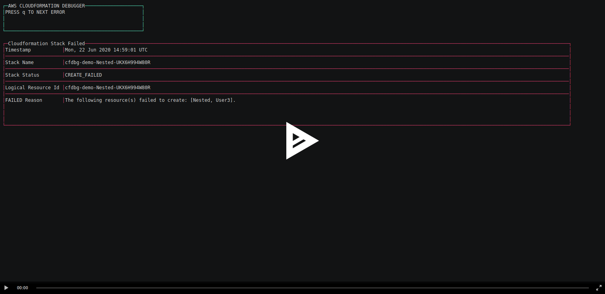

# AWS CloudFormation DEBUGGER

[](https://asciinema.org/a/345615)

Debugging Cloudformation can be time consuming to find the root cause of the rollback process.
This tool will automatically search the failed event since the latest stable state of your stack.

## QuickStart

Download the binary either for Linux or OSX depending of your platform on the github release page

- [Download for Linux](https://github.com/PLAB-IO/aws-cloudformation-debugger/releases/download/v1.0.0/cfdbg-linux)
- [Download for OSX](https://github.com/PLAB-IO/aws-cloudformation-debugger/releases/download/v1.0.0/cfdbg-darwin)

## Usage

Easy to use, compatible with AWS CLI Profile

```
$ cfdbg --profile plab-cloudformation --stack-name cfdbg-demo
```

## Feedback / Contribution

If you'd like to see new features or find a bug, please open an ISSUE and let us know.
Or even better, make the change and submit us a Pull Request.

- Fork :book:
- Code :runner:
- Submit PR :clap: